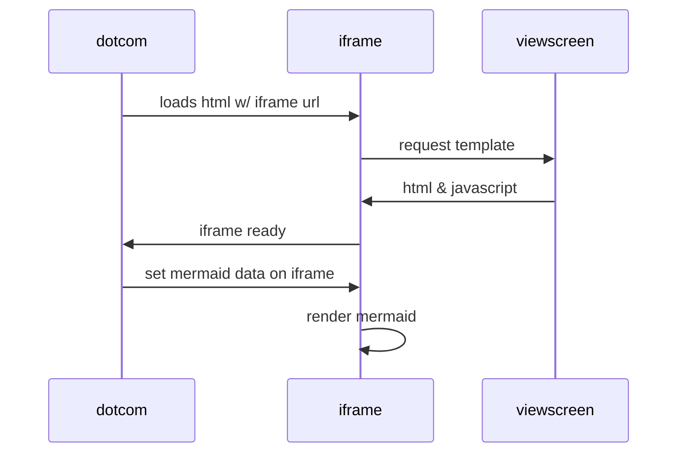

## placeholder for permanent db backup

#### PRD
- Different hosts can be added as folders here
- Should stay current with production
- Including the keys, index folders
#### QA 
- Different hosts can be added as folders here
- Should stay current with qa
- Including the keys, index folders
#### NEED TO FIGURE OUT A WAY TO PUT DB DETAILS IN GRAFANA
